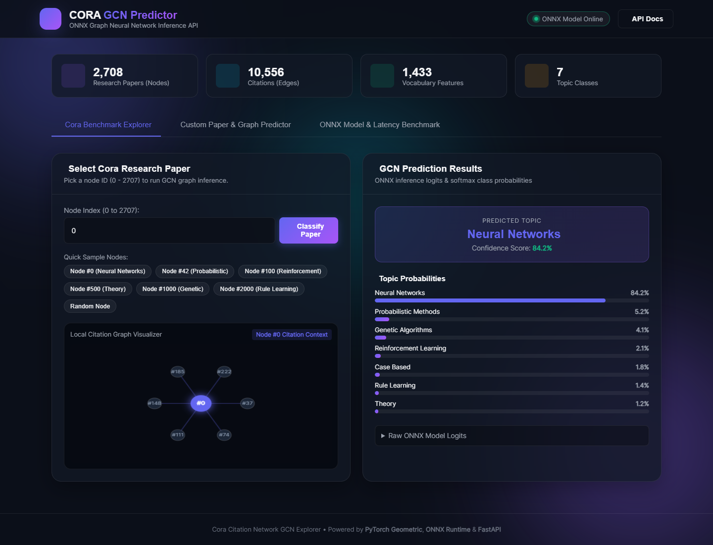
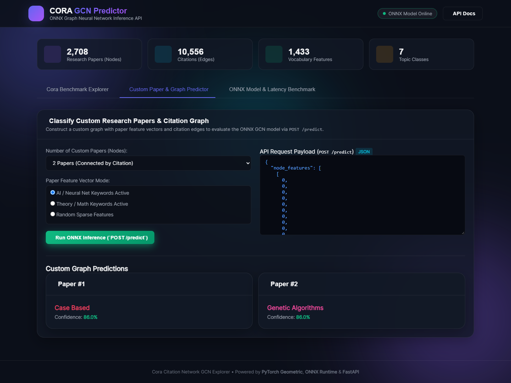
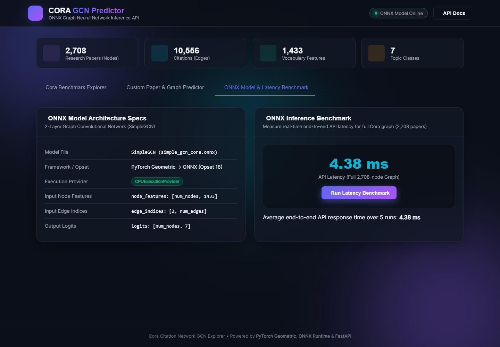

# Cora GCN Research Paper Classifier

An interactive Graph Neural Network project for classifying research papers from the Cora citation network into seven topic categories. The trained SimpleGCN model is exported to ONNX and served through a FastAPI inference API, with a browser UI for exploring real Cora nodes, custom graph inputs, model metadata, and latency.

## What This Project Does

This project predicts the research topic of a paper node by using both:

- The paper feature vector: a 1,433-dimensional bag-of-words representation.
- The citation graph structure: edges between papers in the Cora citation network.

The model returns logits, softmax probabilities, and the predicted class for each requested node.

Supported topic classes:

- Case Based
- Genetic Algorithms
- Neural Networks
- Probabilistic Methods
- Reinforcement Learning
- Rule Learning
- Theory

## UI Screenshots

### Cora Benchmark Explorer

Select any Cora node index from 0 to 2707 and run GCN inference. The UI shows the predicted topic, confidence score, class probabilities, raw logits, and a local citation context visualization.



### Custom Graph Predictor

Generate or edit a custom citation graph payload, then send it to the API through `POST /predict`.



### ONNX Model and Latency Benchmark

View ONNX input/output metadata and run a small latency benchmark against the prediction endpoint.



## Features

- FastAPI backend for model inference.
- ONNX Runtime execution using `simple_gcn_cora.onnx`.
- Real Cora node classification through `POST /predict/cora_node`.
- Custom graph classification through `POST /predict`.
- Static HTML/CSS/JavaScript dashboard in `static/`.
- Optional Streamlit explorer in `streamlit_app.py`.
- Auto-generated Swagger docs at `/docs`.
- Health and model metadata endpoints.

## Tech Stack

- Python
- FastAPI
- ONNX Runtime
- NumPy
- PyTorch Geometric
- Streamlit
- HTML, CSS, JavaScript

## Project Structure

```text
.
|-- main.py
|-- streamlit_app.py
|-- requirements.txt
|-- simple_gcn_cora.onnx
|-- simple_gcn_cora.onnx.data
|-- cora_citation_network_classification_GNN.ipynb
|-- data/
|   `-- Planetoid/Cora/
|-- static/
|   |-- index.html
|   |-- index.css
|   `-- app.js
`-- docs/
    `-- screenshots/
```

## Setup

Create and activate a virtual environment:

```bash
python -m venv .venv
.venv\Scripts\activate
```

Install dependencies:

```bash
pip install -r requirements.txt
```

Run the FastAPI app:

```bash
uvicorn main:app --reload
```

Open the UI:

```text
http://127.0.0.1:8000
```

Open API docs:

```text
http://127.0.0.1:8000/docs
```

## Deployment

Recommended production start command:

```bash
uvicorn main:app --host 0.0.0.0 --port $PORT
```

If your hosting platform is configured to run the FastAPI CLI, this project also supports it because `requirements.txt` installs `fastapi[standard]`:

```bash
fastapi run main.py --host 0.0.0.0 --port $PORT
```

## API Endpoints

### Health Check

```http
GET /health
```

Returns service status and active ONNX Runtime providers.

### Model Info

```http
GET /info
```

Returns feature dimension, class mapping, ONNX inputs, and ONNX outputs.

### Predict Real Cora Nodes

```http
POST /predict/cora_node
```

Example payload:

```json
{
  "node_indices": [0, 1, 42]
}
```

### Predict a Custom Graph

```http
POST /predict
```

Example payload shape:

```json
{
  "node_features": [
    [0, 1, 0, "... 1433 total values ..."],
    [1, 0, 0, "... 1433 total values ..."]
  ],
  "edge_indices": [
    [0, 1],
    [1, 0]
  ]
}
```

Each node feature vector must contain exactly 1,433 numeric values. If `edge_indices` is omitted, the API adds self-loops for each node.

## Streamlit UI

The project also includes a Streamlit dashboard:

```bash
streamlit run streamlit_app.py
```

By default, the Streamlit app points to a deployed API URL. To use it locally, update the API base URL in the sidebar to:

```text
http://127.0.0.1:8000
```

## Model Notes

- Dataset: Cora citation network.
- Nodes: 2,708 research papers.
- Edges: 10,556 citation links.
- Feature size: 1,433.
- Output classes: 7.
- Runtime model format: ONNX.

## Notebook

The notebook `cora_citation_network_classification_GNN.ipynb` contains the model experimentation/training workflow used for the Cora GCN classifier.
